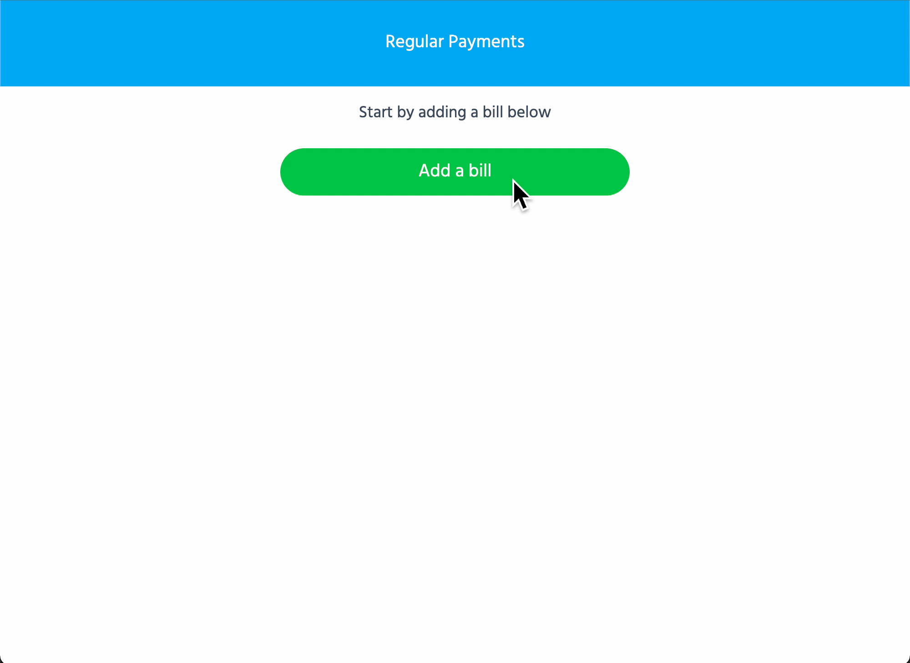

# WonderBill Frontend Take Home

## Description

This is the WonderBill frontend coding challenge to build a bill payment app. Thank you for taking the time to take a look at my submission!

## Libraries/Tools used

- Typescript with React
- React Context for state management
- TailwindCSS for styling
- Formik with Yup for form input and validation
- date-fns for date formatting
- React testing library for unit testing

## Assumptions

I have assumed for simplicity that a month is equal to 4 weeks

## Improvements

I have tried to time box my attempt at this challenge. Given more time I would add further testing to each of the pages. [Mock service worker](https://mswjs.io/) could be used to mock the api to use as test data.

## Setting project up

- Start the backend server - Navigate to `./api` and run `yarn && yarn start`
- Start the frontend - Navigate to `./web-app` and run `yarn && yarn start`. Open [http://localhost:3000](http://localhost:3000) to view it in the browser.

## Example usage

## Thank you!
